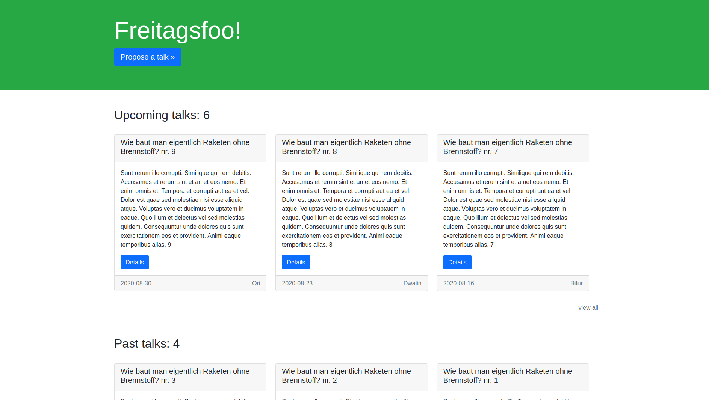

# Freitagsfoo! (AAS)

Super basic piece of Software for handling talk submissions.



## Usage

Well, It's pretty straitfowards…

## Setup

1. Adjust the docker-compose.yml how you'd like (you don't need to change
anything, but could for example add labels so traefik is able to router to
the container)
1. Edit the config.yml with the great password you just set for the database
(You did create a good password didn't you? if not, now's the moment to change
that!)
1. Start the `freitagsfoo` and `postgres` service:

```bash
$ docker-compose up -d freitagsfoo postgres
…
```
